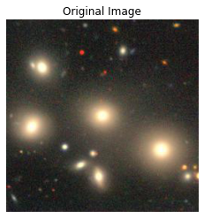
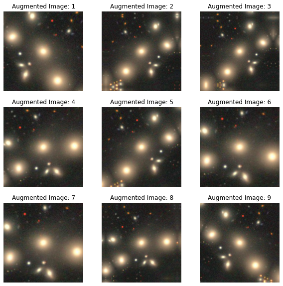
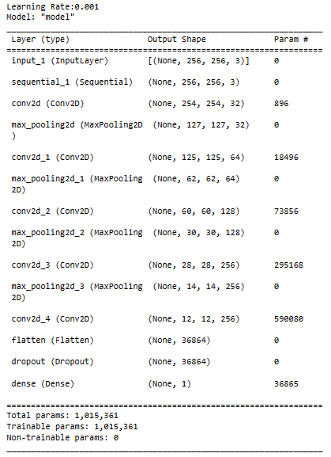
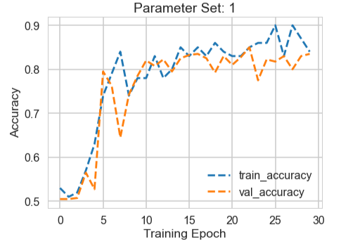
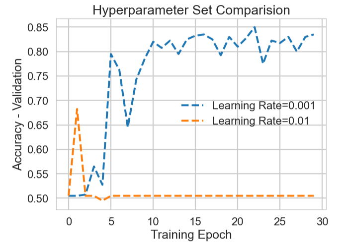
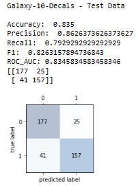

# Deep-Learning-Augmentation-and-Learning-Rate

Code to study data augmentation and the learning rate hyperparameter for image classification.

### Summary of Notebook Outputs

These outputs below are generated in the included Jupyter Notebookusing Python, Tensorflow/Keras, and Scikit-Learn, along with supporting libraries (e.g., Numpy).

### Data Augmentation in Computer Vision

Data augmentation increases the size of a training dataset by applying various transformations to the original images to generate synthetic images based on a reference dataset. Data augmentation helps to create computer vision deep learning models that are more robust and reduces the risk of overfitting, particularly when the original dataset is small.

Data augmentation helps computer vision models along several dimensions:

**Combat Overfitting**: Overfitting occurs when a model learns the training data too well, including its noise and outliers, and performs poorly on unseen data. By augmenting the data, the model gets exposed to various variations of the data, making it generalize better to new, unseen examples.

**Increase Dataset Size**: For deep learning models, having a larger dataset is beneficial. However, collecting new data can be expensive or impractical. Augmentation is a way to synthetically expand the dataset.

**Improve Model Robustness**: By exposing the model to different variations of the data during training, the model becomes more robust to these variations during inference.

In the notebook we demonstrate two approaches to image data augmentation. These are on-the-fly augmentation and pre-computed augmentation:

**On-the-fly Augmentation**: During each epoch of training, images are read from disk and augmented in real-time before being fed into the model. This ensures that the model sees slightly different variations of images in each epoch. Libraries like TensorFlow and Keras provide utilities to do on-the-fly augmentation.

**Pre-computed Augmentation**: Transformations are applied to the entire dataset in advance, and the augmented images are saved to disk. The model then trains on this expanded dataset.

**Summary of Data Augmentation Techniques for Image Data**:

**Geometric Transformations**: These transformations alter the spatial arrangement of pixels in the image. Examples include:

- **Rotation**: Turning the image around its center.

- **Translation**: Shifting the image in any direction.

- **Scaling**: Enlarging or shrinking the image.

- **Flipping**: Reflecting the image either horizontally or vertically.

- **Shearing**: Skewing the image in a particular direction.

- **Elastic Deformation**: Applying local distortions to the image.

**Photometric Transformations**: These alter the appearance, color, or brightness of the image. Examples include:

- **Brightness Adjustment**: Changing the intensity of the image pixels.

- **Contrast Adjustment**: Modifying the difference in intensity between the lightest and darkest regions.

- **Gamma Correction**: Adjusting the brightness using a non-linear function.

- **Color Jittering**: Randomly changing the brightness, contrast, saturation, and hue.

**Mixup and CutMix**: These are advanced augmentation methods where two images are blended together. In the case of CutMix, a region from one image is "cut" and "pasted" onto another image.

**Random Erasing**: Randomly removing a section of the image, which can help the model to not overly rely on localized features.

There are definite limitations and considerations to keep in mind when deploying data augmentation strategies in computer vision:

**Not Always Appropriate**: Some augmentations might not make sense for certain datasets. For example, vertical flipping might not be suitable for digit recognition as a flipped "6" can resemble a "9".

**Computational Overhead**: On-the-fly augmentation can introduce additional computation during training, potentially slowing down the training process.

**No Substitute for Real Data**: While augmentation can improve model performance on limited datasets, it's no substitute for genuine, diverse data, especially if certain variations or conditions are not represented in the original dataset.

Data augmentation can be a crucial strategy for training robust deep learning models, particularly when faced with limited data. Data augmentation, whether performed on-the-fly or pre-computed, artificially introduces variability, ensuring that the model is exposed to a wide range of potential scenarios it might encounter in the real world.

### Learning Rate Hyperparameter in Deep Learning

**Learning rate** is one of the most critical hyperparameters in the training of deep learning models, including the example here of training deep convolutional neural networks (CNNs) for image classification. The learning rate determines how much the model should adjust its weights in response to the calculated gradient from the loss function.

Some important considerations for learning rate values in training deep learning models:

**Step Size in Optimization**: The learning rate determines the magnitude of the steps taken in the weight space towards the minimum of the loss function. A larger learning rate results in bigger jumps, while a smaller learning rate results in smaller jumps.

**Convergence Speed**: A high learning rate might speed up convergence initially since it covers more ground in fewer steps.
However, if the learning rate is too high, the model can overshoot the optimal point in the loss landscape, potentially causing divergence, where the loss becomes unstable and increases.
On the other hand, a small learning rate ensures more careful and precise steps, but it may lead to slower convergence.
Local Minima & Saddle Points: A slightly higher learning rate can sometimes help the model jump out of local minima or avoid getting stuck in saddle points, which are common in high-dimensional spaces like those of deep neural networks.

**Generalization and Overfitting**: Very high learning rates can prevent a model from converging, which could result in underfitting.Very low learning rates, especially if not reduced over time, can cause the model to overfit, as the model might start fitting to the noise in the training data after already capturing the main patterns. 

**Learning Rate Schedules**: In practice, using a fixed learning rate throughout training may not be optimal. Adaptive learning rate schedules, like learning rate annealing, step decay, or using algorithms like Adam which adaptively adjust the learning rate, can help in converging faster and reaching better local optima.

**Warmup**: Some modern training approaches start with a smaller learning rate and then "warm up" to a larger learning rate in the initial epochs. This approach can stabilize training in the initial phases.

**Impact of Batch Normalization**: If you're using batch normalization layers in a CNN, they can somewhat mitigate the effects of the learning rate, as they tend to stabilize the activations, making the model a bit more robust to variations in learning rate.

When training a CNN for image classification, it is good practice to experiment with different learning rates and potentially use learning rate schedules or adaptive learning rate methods. Monitoring the training and validation loss and accuracy give strong insights into whether the learning rate is too high, too low, or optimal for a give model and dataset.

## Other Resources

There are many interesting and useful hyperparameter tuning libraries available as Python packages. Some noteworthy resources to look into include:

- **scikeras**: Scikit-Learn API wrapper for Keras. https://pypi.org/project/scikeras/

- **Tensorflow wrapper**: tf.keras.wrappers.scikit_learn

- **scikit-optimize (skopt)**: Sequential model-based optimization toolbox. A popular approach from skopt is BayesSearchCVhttps://pypi.org/project/scikit-optimize/

**Bayesian optimization** is a global optimization technique tailored for optimizing complex and potentially noisy functions that are costly to evaluate. The primary idea behind Bayesian optimization is to treat the objective function as a random function and put a prior over it. After evaluating the function at some points, we update our beliefs using Bayes' theorem, which gives us a posterior distribution over functions. Using this posterior, we can determine the next point to evaluate the objective function, such that we balance exploration (sampling in regions where the uncertainty is high) with exploitation (sampling in regions where the expected value is low).

**BayesSearchCV** from Scikit-Optimize (SKOPT) is a tool that integrates Bayesian optimization with cross-validated hyperparameter search over a specified parameter space. Here's a brief overview of its concepts and algorithm:

**Gaussian Process (GP)**: One of the popular surrogate models used in Bayesian optimization. A GP models the function as a distribution over functions. After observing some data points, the GP updates its beliefs (in the form of mean and variance) about this distribution.

**Acquisition Function**: Once we have our surrogate model, we need a way to decide where to sample next. The acquisition function calculates the utility of sampling each point in the input space. Common acquisition functions include Expected Improvement (EI), Probability of Improvement (PI), and Gaussian Process Upper Confidence Bound (GP-UCB). The point that maximizes the acquisition function is chosen as the next point to evaluate.

**Summary of BayesSearchCV Algorithm as Implemented in the Scikit-Optimize library**:

- Define the parameter space for hyperparameters.

- Randomly select some initial points and evaluate them using cross-validation.

- Fit the Gaussian Process on the evaluated points.

- Calculate the acquisition function over the parameter space using the GP model.

- Select the point that maximizes the acquisition function and evaluate it.

- Update the GP with the new point.

- Repeat steps 3-6 until a stopping criterion is met (like a maximum number of evaluations).

**Tree-structured Parzen Estimator (TPE)**: Though GP is the default model in BayesSearchCV, SKOPT also provides support for other models like TPE. TPE is a non-parametric approach that models the probability of improvement based on observed samples.

**Handling Categorical Variables**: One challenge in hyperparameter optimization is that the parameter space can be a mix of continuous, ordinal, and categorical variables. BayesSearchCV uses a one-hot encoding scheme internally to handle categorical variables and optimize them in the continuous latent space.

**Parallelization**: Since evaluating the objective function (which, in the case of BayesSearchCV, is the cross-validated performance of a model with a given hyperparameter setting) can be computationally expensive, the tool allows for parallel evaluations using joblib's parallelization capabilities.

BayesSearchCV offers a more systematic approach to hyperparameter optimization compared to traditional methods like **grid search** and **random search**. By building a probabilistic model of the objective function and updating it with new data, Bayesian optimization can efficiently explore the hyperparameter space and find better settings with fewer evaluations.

It is also important not to underestimate the power of random search for hyperparameter optimization in machine learning. Though simple, in some situations (ref google cloud hyperparam-optimization with high-dimensional data) random search should be favored over grid search and Bayesian optimization approaches.

(grid search, Bayesian, random search, hyperband)

- **optuna**: A hyperparameter optimization framework. https://pypi.org/project/optuna/

- **keras-tuner**: A Hyperparameter Tuning Library for Keras. https://pypi.org/project/keras-tuner/

- **autokeras**: AutoML for deep learning. Developed by DATA Lab at Texas A&M University. https://pypi.org/project/autokeras/

- **autogluon**: AutoML for Image, Text, and Tabular Data. https://pypi.org/project/autogluon/

## Summary of Major Approaches to Hyperparameter Tuning in Machine Learning

**Grid Search**:

-Overview: Systematically search through a predefined range of hyperparameter values.

-Pros: Exhaustive and guaranteed to find the best parameter in the given range.

-Cons: Computationally expensive, especially if the hyperparameter space is large.

Random Search:

Overview: Randomly sample hyperparameter values from a defined range or distribution.
Pros: Less computational cost than grid search. Empirical evidence suggests it can find good hyperparameters more efficiently than grid search.
Cons: Not exhaustive. No guarantee to find the global optimum.
Bayesian Optimization:

Overview: Uses a probabilistic model to predict which hyperparameters are likely to yield better performance. Based on previous evaluations, it decides which set of hyperparameters to try next.
Pros: More efficient than random or grid search. Finds good hyperparameters with fewer function evaluations.
Cons: Complexity in setting up and understanding the underlying Gaussian processes.
Gradient-based Optimization:

Overview: For some models, it's possible to compute the gradient of the performance metric with respect to hyperparameters, which allows for optimization techniques similar to those used for training.
Pros: Direct optimization of hyperparameters.
Cons: Not applicable to all types of models and hyperparameters.
Evolutionary Algorithms:

Overview: Inspired by the process of natural selection, this method involves generating a population of hyperparameter configurations, selecting the best ones based on performance, and producing offspring configurations for the next generation.
Pros: Can explore a large search space and often find non-obvious solutions.
Cons: Might require many evaluations to converge.
Population-based Training:

Overview: Start training many neural networks concurrently with random hyperparameters. Periodically stop and copy the best ones, perturbing their hyperparameters.
Pros: Can adapt hyperparameters while training, which may speed up convergence.
Cons: Resource-intensive.
Hyperband:

Overview: An enhancement of random search that focuses on budget allocation for evaluations. Allocates more resources to promising configurations.
Pros: Efficient in terms of resource allocation, often leading to faster discovery of good hyperparameters.
Cons: Relies on the assumption that configurations that perform well with a small budget will continue to perform well with a larger budget.
Meta-learning:

Overview: Use previous experiences from other datasets and tasks to predict good starting hyperparameters.
Pros: Can significantly speed up the search process if prior knowledge is relevant.
Cons: Requires a diverse history of tasks and results to be effective.
Note: It's important to keep in mind that the choice of hyperparameter tuning method might depend on the specifics of the problem, available computational resources, and the size of the hyperparameter space. Additionally, while finding the optimal hyperparameters can improve model performance, it's crucial to ensure that the model doesn't overfit to the training data, which would harm its generalization to unseen data.